# Directus Schema Models (EMI)

[](https://github.com/earth-metabolome-initiative/directus-schema-models/actions)
[](https://github.com/earth-metabolome-initiative/directus-schema-models/actions)
[](https://opensource.org/licenses/MIT)

This repository contains the Rust models generated from the legacy Directus database schema used by the Earth Metabolome Initiative (EMI). These models are primarily used to facilitate the migration of data from the deprecated Directus system to our new architecture. The generated code relies extensively on [`diesel-builders`](https://github.com/LucaCappelletti94/diesel-builders/) derives to maintain a very minimal amount of non-derived generated code (1904 lines for 52 tables, ~37 lines per table), focusing on human-readable schema definitions and relationships. Each table is generated as a separate crate within a Cargo workspace, allowing for modular usage and parallel compilation.

Additionally, this project serves as a proof of concept for `synql`, our library designed to generate strongly-typed Rust models from various SQL backends (PostgreSQL, raw SQL documents, etc.).

## Repository Structure

- **`builder/`**: Contains the Rust application that connects to the database, introspects the schema, and generates the model code.
- **`emi_deprecated_models/`**: The output directory containing the generated Rust crates for the database schema.
- **`kg.py`**: A python script that uses [GRAPE](https://github.com/AnacletoLAB/grape) to load and analyze the knowledge graph generated by `sql2kg`, which represents the database schema and data.



## Knowledge Graph Export

We have added support for generating a Knowledge Graph (KG) from the database schema using [`sql2kg`](https://github.com/earth-metabolome-initiative/sql2kg). This allows for the export of nodes and edges representing the database structure and data, which can then be analyzed using graph algorithms.

You can see an example of how to configure and run the export in `builder/src/bin/kg.rs`. The exported data can be loaded and analyzed using the [GRAPE](https://github.com/AnacletoLAB/grape) library, as demonstrated in the [`kg.py`](kg.py) script included in this repository.

You can generate the knowledge graph CSV files by running the `kg` binary (should take around 30 seconds):

```bash
cargo run --bin kg --release
```

## Prerequisites

To build and run the generator, ensure you have the following installed:

- **[Rust & Cargo](https://www.rust-lang.org/tools/install)**: The Rust programming language and package manager.
- **[Taplo](https://taplo.tamasfe.dev/cli/installation/cargo.html)**: A TOML formatter used to format the generated `Cargo.toml` files.

  ```bash
  cargo install taplo-cli --locked
  ```

- **Access to the Directus Database**: The builder requires a connection to the running PostgreSQL instance containing the Directus schema.

## Setup and Usage

1. **Clone the repository:**

    ```bash
    git clone https://github.com/earth-metabolome-initiative/directus-schema-models
    cd directus-schema-models
    ```

2. **Configure the Builder:**
    Navigate to the `builder` directory and create a configuration file.

    ```bash
    cd builder
    cp config.toml.example config.toml
    ```

    Edit `config.toml` with the appropriate database connection details.

3. **Run the Builder:**
    Execute the builder to generate the models.

    ```bash
    cargo run --release
    ```

    The process involves:
    - Connecting to the database.
    - Introspecting the schema.
    - Generating Rust code in the `emi_deprecated_models` directory.
    - Formatting the code using `rustfmt` and `taplo`.

## Performance

One of the key goals of `synql` is speed. Below are the performance metrics for this project. Note that the lion's share of the compilation time is caused by the extremely large tables present in this deprecated schema, which results in a large volume of generated code, expecially in the [`diesel`](https://github.com/diesel-rs/diesel) crate itself.

| Operation | Real | User | Sys |
| :--- | :--- | :--- | :--- |
| **Compilation (uncached)** | 2m45.344s | 6m17.286s | 0m29.650s |
| **Execution (compiled)** | 0m6.711s | 0m0.367s | 0m0.508s |
| **Cargo check (uncached)** | 0m50.123s | 1m45.456s | 0m12.345s |
